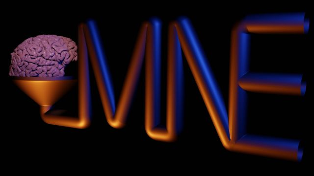

# mne-pipeline-hd

### A Pipeline-GUI for [MNE-Python](https://mne.tools/stable/index.html)  from MEG-Lab Heidelberg

## Installation

1. Install MNE-python as instructed on
   the [website](https://www.martinos.org/mne/stable/install_mne_python.html),
   I would recommend to install in a separate conda environment with:
   `conda env create -n mne_p -f environment.yml`
2. `conda activate mne_p`
3. `pip install https://github.com/marsipu/mne-pipeline-hd/zipball/main`

## Update

Run `pip install --upgrade --no-deps --force-reinstall https://github.com/marsipu/mne-pipeline-hd/zipball/main`
for an update to the development version
or `pip install --upgrade mne-pipeline-hd` for the latest release.

## Start

Run `mne_pipeline_hd` in your mne_pipeline-environment (`conda activate mne_p`)

**or**

run \_\_main\_\_.py from the terminal or an IDE like PyCharm, VSCode, Atom,
etc.

***When using the pipeline and its functions bear in mind that the pipeline is
still in development!
The basic functions supplied are just a suggestion and you should verify before
usage if they do what you need.
They are also partly still adjusted to specific requirements which may not
apply to all data.***

## Bug-Report/Feature-Request

Please report bugs on GitHub as an issue or to me (dev@mgschulz.de)
directly.
And if you got ideas on how to improve the pipeline or some feature-requests,
you are welcome to open an issue too or send an e-mail (dev@mgschulz.de)

## Contribute and build your own functions/fix bugs

I you want to help by contributing, I would be very happy:

You need a [GitHub-Account](https://github.com/)
and should
have [git](https://git-scm.com/book/en/v2/Getting-Started-Installing-Git)
installed.

1. Fork this repository on GitHub
2. Move to the folder where you want to clone to
3. Clone **your forked repository** with git from a
   terminal: `git clone <url you get from the green clone-button from your forked repository on GitHub>`
4. Add upstream to git for
   updates: `git remote add upstream git://github.com/marsipu/mne-pipeline-hd.git`
5. Install development version with pip: `pip install -e .[tests]`
6. Install the pre-commit hooks with: `pre-commit install`
7. Create a branch for changes: `git checkout -b <branch-name>`
8. Commit changes: `git commit -am "<your commit message>"`
9. Push changes to your forked repository on GitHub: `git push`
10. Make "New pull request" from your new feature branch

You can always [write me](mailto:dev@mgschulz.de), if you have questions
about the contribution-process
or about the program-structure.

## Acknowledgments

This Pipeline is build on top
of [MNE-Python](https://mne.tools/stable/index.html)
> A. Gramfort, M. Luessi, E. Larson, D. Engemann, D. Strohmeier, C. Brodbeck,
> L. Parkkonen, M. Hämäläinen,
> MNE software for processing MEG and EEG data, NeuroImage, Volume 86, 1
> February 2014, Pages 446-460, ISSN 1053-8119,
> [DOI](https://doi.org/10.1016/j.neuroimage.2013.10.027)

It was inspired by a pipeline
from [Lau M. Andersen](https://doi.org/10.3389/fnins.2018.00006)
> Andersen LM. Group Analysis in MNE-Python of Evoked Responses from a Tactile
> Stimulation Paradigm: A Pipeline for
> Reproducibility at Every Step of Processing, Going from Individual Sensor
> Space Representations to an across-Group
> Source Space Representation. Front Neurosci. 2018 Jan 22;12:6. doi:
> 10.3389/fnins.2018.00006. PMID: 29403349;
> PMCID: PMC5786561.

This program also
integrates [autoreject](https://doi.org/10.1016/j.neuroimage.2017.06.030)
> Mainak Jas, Denis Engemann, Yousra Bekhti, Federico Raimondo, and Alexandre
> Gramfort. 2017.
> “Autoreject: Automated artifact rejection for MEG and EEG data”. NeuroImage,
> 159, 417-429.

Many ideas and basics for GUI-Programming where taken
from [LearnPyQt](https://www.learnpyqt.com/) and numerous
stackoverflow-questions/solutions.

The development is financially supported
by [Heidelberg University](https://www.uni-heidelberg.de/de/forschung/forschungsprofil/fields-of-focus/field-of-focus-i).

Thank you to the members of my laboratory (especially my
supervisor [Andre Rupp](https://www.klinikum.uni-heidelberg.de/personen/pd-dr-phil-andre-rupp-271))
for their feedback and testing in the early stages of development.
